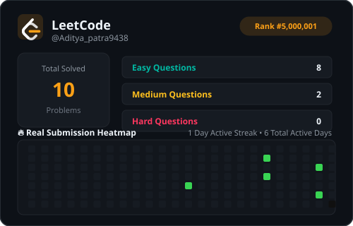
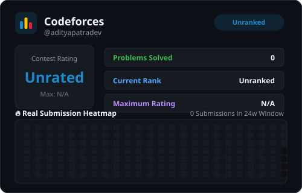
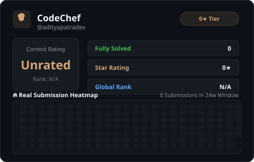
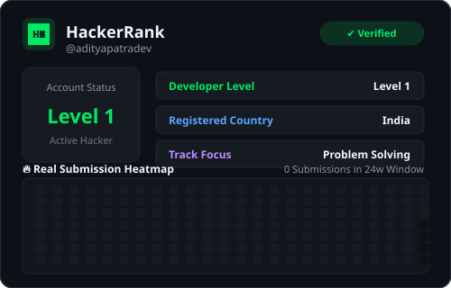
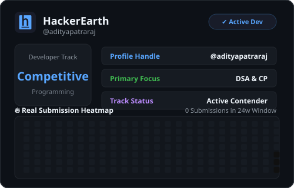
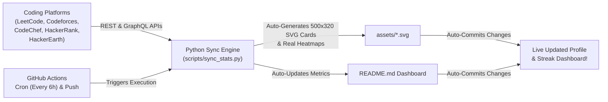

<div align="center">

<!-- Custom High-Resolution Animated Neon Header Banner -->
<a href="https://github.com/AdityaPatra-dev">
  
</a>

<!-- Dynamic Animated Typing SVG -->
<a href="https://github.com/AdityaPatra-dev">
  
</a>

<br/>

<!-- Technology Badges & Relevant Animated 3D Stickers Row -->
<p align="center">
  
  
  &nbsp;&nbsp;
  
  
  &nbsp;&nbsp;
  
  
  &nbsp;&nbsp;
  
  
  &nbsp;&nbsp;
  
  
  &nbsp;&nbsp;
  
  
</p>

<!-- Live Shield Badges Row: Metrics -->
<p align="center">
  
  
  
  
</p>

<!-- Animated Divider Line -->


</div>

---

## 🧭 Interactive Navigation

<div align="center">

| 📖 [Overview](#-repository-overview) | 📊 [Live Automated Stats](#-live-automated-metrics) | 🏆 [Live Platform Cards](#-live-platform-cards--templates) |
| :---: | :---: | :---: |
| 💻 [Profiles Directory](#-competitive-programming-profiles) | 🗂️ [Folder Structure](#️-repository-architecture) | 🤖 [How Auto-Sync Works](#-how-automation-works) |

</div>

---

## 📖 Repository Overview

> **Welcome to Aditya Patra's Competitive Programming & DSA Vault!**  
> This repository serves as a centralized, battle-tested archive of algorithmic solutions implemented in **Modern C++ (C++20)** and **C (C11)**. Every solution is written with clean time & space complexity, modular architectures, and idiomatic low-level techniques.
>
> 🚀 **Core Highlights:**
> - ⚡ **Bilingual Tracks**: Dedicated workspaces for STL-powered C++ ([`dsa with c++`](./dsa%20with%20c%2B%2B)) and manual memory/pointer mastery in C ([`dsa with c`](./dsa%20with%20c)).
> - 🤖 **Fully Automated CI/CD Sync**: Scheduled GitHub Actions workflows trigger every 6 hours and on code pushes to fetch live metrics via platform APIs.
> - 🔥 **Real Submission Heatmaps**: Auto-rendered 500×320 SVG cards with verified green-dot heatmaps, global rankings, and daily streaks across **LeetCode**, **Codeforces**, **CodeChef**, **HackerRank**, and **HackerEarth**.

---

## ⚡ Live Automated Metrics

> [!NOTE]
> This section is **100% automated**! Our GitHub Actions bot connects directly to **LeetCode**, **Codeforces**, **CodeChef**, **HackerRank**, and **HackerEarth** APIs every 6 hours and whenever code is pushed, updating problems solved, global rankings, and streaks in real-time.

<!-- LIVE_STATS:START -->
<div align="center">

### ⚡ Automated Real-Time Competitive Programming Summary
*Last auto-synchronized on: `2026-10-06 12:50:12 UTC` via GitHub Actions*

| Platform | Handle | Questions Solved | Current Rating / Rank | Streak / Activity | Quick Status |
| :--- | :--- | :---: | :---: | :---: | :---: |
|  **LeetCode** | [`Aditya_patra9438`](https://leetcode.com/u/Aditya_patra9438/) | **10** <br/><sub>(🟢 8 Easy \| 🟡 2 Med \| 🔴 0 Hard)</sub> | Global Rank: **#5,000,001** | 🔥 **1 Day** Streak<br/><sub>(6 Active Days)</sub> |  |
|  **Codeforces** | [`adityapatradev`](https://codeforces.com/profile/adityapatradev) | **0** Solved | **Unrated** (`Unranked`) | Contest Ready |  |
|  **CodeChef** | [`adityapatradev`](https://www.codechef.com/users/adityapatradev) | **0** Solved | Rating: **Unrated** (0★) | Division Contender |  |
|  **HackerRank** | [`adityapatradev`](https://hackerrank.com/profile/adityapatradev) | Problem Solving | Problem Solver | Verified Profile |  |
|  **HackerEarth** | [`adityapatraraj`](https://hackerearth.com/@adityapatraraj/) | Practice Tracks | Competitive Track | Verified Profile |  |

<br/>

<table border="0">
  <tr>
    <td align="center"><b>🎯 Total Cross-Platform Solved</b></td>
    <td align="center"><b>🔥 Current LeetCode Streak</b></td>
    <td align="center"><b>🏆 Target Goal</b></td>
  </tr>
  <tr>
    <td align="center"><h3><code>10+ Problems</code></h3></td>
    <td align="center"><h3><code>1 Day Continuous</code></h3></td>
    <td align="center"><h3><code>500+ Questions in C &amp; C++</code></h3></td>
  </tr>
</table>

</div>
<!-- LIVE_STATS:END -->

---

## 🏆 Live Platform Cards & Templates

<div align="center">

<a href="https://leetcode.com/u/Aditya_patra9438/" target="_blank">
  
</a>

<br/><br/>

<table border="0" width="100%">
  <tr>
    <td align="center" width="50%">
      <a href="https://codeforces.com/profile/adityapatradev" target="_blank">
        
      </a>
    </td>
    <td align="center" width="50%">
      <a href="https://www.codechef.com/users/adityapatradev" target="_blank">
        
      </a>
    </td>
  </tr>
  <tr>
    <td align="center" width="50%">
      <a href="https://www.hackerrank.com/profile/adityapatradev" target="_blank">
        
      </a>
    </td>
    <td align="center" width="50%">
      <a href="https://www.hackerearth.com/@adityapatraraj/" target="_blank">
        
      </a>
    </td>
  </tr>
</table>

</div>

---

## 💻 Competitive Programming Profiles

<div align="center">

| Platform | Direct Profile Link | Handle | Live Badge |
| :---: | :---: | :---: | :---: |
| **LeetCode** | [leetcode.com/u/Aditya_patra9438](https://leetcode.com/u/Aditya_patra9438/) | `Aditya_patra9438` | <a href="https://leetcode.com/u/Aditya_patra9438/"></a> |
| **Codeforces** | [codeforces.com/profile/adityapatradev](https://codeforces.com/profile/adityapatradev) | `adityapatradev` | <a href="https://codeforces.com/profile/adityapatradev"></a> |
| **CodeChef** | [codechef.com/users/adityapatradev](https://www.codechef.com/users/adityapatradev) | `adityapatradev` | <a href="https://www.codechef.com/users/adityapatradev"></a> |
| **HackerRank** | [hackerrank.com/profile/adityapatradev](https://www.hackerrank.com/profile/adityapatradev) | `adityapatradev` | <a href="https://www.hackerrank.com/profile/adityapatradev"></a> |
| **HackerEarth** | [hackerearth.com/@adityapatraraj](https://www.hackerearth.com/@adityapatraraj/) | `adityapatraraj` | <a href="https://www.hackerearth.com/@adityapatraraj/"></a> |
| **GeeksforGeeks** | [geeksforgeeks.org/user/Aditya_patra9438](https://www.geeksforgeeks.org/user/Aditya_patra9438/) | `Aditya_patra9438` | <a href="https://www.geeksforgeeks.org/user/Aditya_patra9438/"></a> |

</div>

---

## 🗂️ Repository Architecture

Organized cleanly into two dedicated folders ready for daily solutions:

```text
📦 DSA
 ┣ 📂 dsa with c++    <-- Add your daily C++ solutions here
 ┃ ┗ 📜 .gitkeep
 ┣ 📂 dsa with c      <-- Add your daily C solutions here
 ┃ ┗ 📜 .gitkeep
 ┣ 📂 assets          <-- Dynamic SVG cards & banners (auto-generated)
 ┣ 📂 scripts
 ┃ ┗ 📜 sync_stats.py <-- Automation worker scanning files & fetching APIs
 ┣ 📂 .github
 ┃ ┗ 📂 workflows
 ┃   ┗ 📜 sync-stats.yml <-- GitHub Actions workflow (runs every 6h & on push)
 ┗ 📜 README.md       <-- Interactive Live Dashboard
```

<div align="center">

| Folder | Target Language | Typical File Naming | Description |
| :--- | :--- | :--- | :--- |
| ⚡ **[`dsa with c++`](./dsa%20with%20c%2B%2B)** | C++ (Modern C++17/20) | `two_sum.cpp` or `01-arrays/two_sum.cpp` | Solutions leveraging C++ STL, OOP, templates, vectors |
| 🔧 **[`dsa with c`](./dsa%20with%20c)** | C (C99/C11) | `two_sum.c` or `01-arrays/two_sum.c` | Solutions using pure C with manual pointer & memory management |

</div>

---

## 🤖 How Automation Works



1. **GitHub Actions Workflow** ([`.github/workflows/sync-stats.yml`](./.github/workflows/sync-stats.yml)) triggers automatically every 6 hours and whenever code is pushed.
2. The Python engine ([`scripts/sync_stats.py`](./scripts/sync_stats.py)) queries the GraphQL/REST endpoints of all 5 platforms.
3. Authentic **500x320** SVG cards with real submission heatmaps, streaks, and official logos are rendered into `assets/`.
4. Live cross-platform metrics are synchronized into `README.md`.
5. Changes are committed and pushed automatically by `github-actions[bot]`.

---

## 📬 Connect & Socials

<div align="center">

<p align="center">
  <a href="https://github.com/AdityaPatra-dev"></a>
  <a href="https://leetcode.com/u/Aditya_patra9438/"></a>
  <a href="https://codeforces.com/profile/adityapatradev"></a>
  <a href="https://www.codechef.com/users/adityapatradev"></a>
  <a href="https://www.hackerrank.com/profile/adityapatradev"></a>
  <a href="https://www.hackerearth.com/@adityapatraraj/"></a>
  <a href="https://www.geeksforgeeks.org/user/Aditya_patra9438/"></a>
</p>

<!-- Animated Footer Wave -->


<p align="center">
  <sub>Engineered with ❤️ &amp; ☕ by <a href="https://github.com/AdityaPatra-dev"><b>Aditya Patra</b></a> • Keep Grinding &amp; Solving Daily! 🚀</sub>
</p>

</div>
